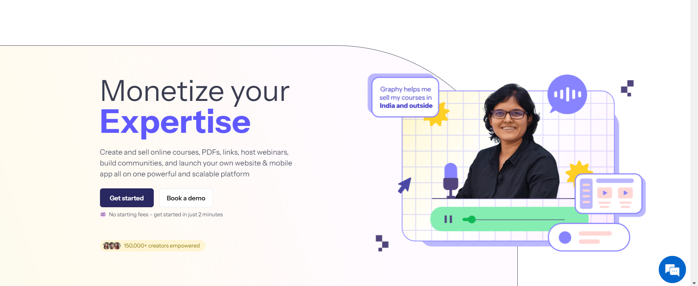
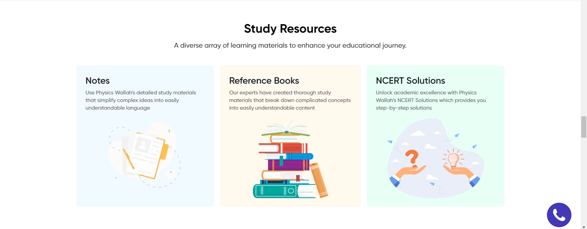
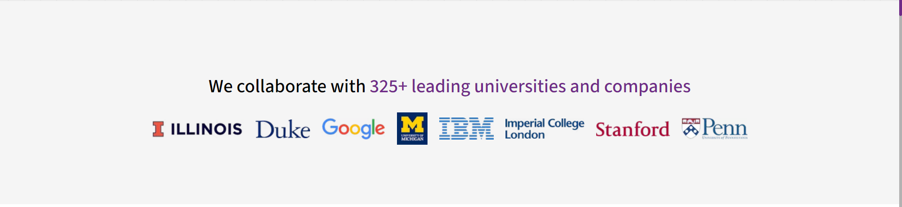
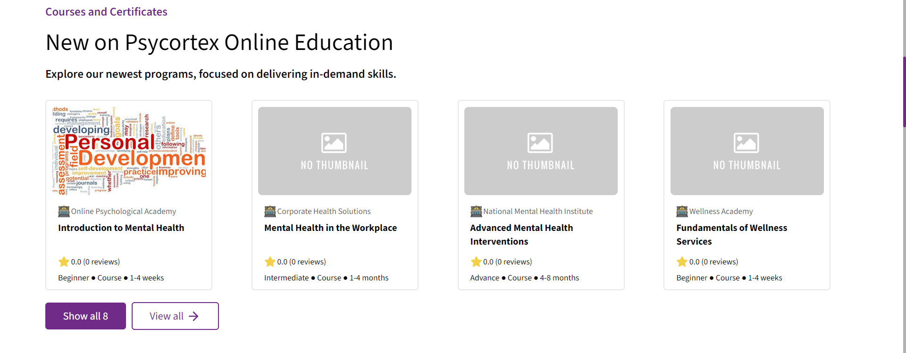
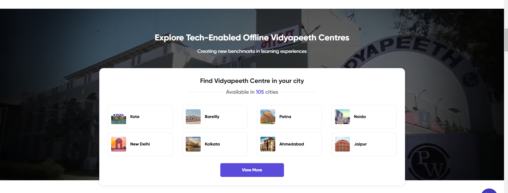
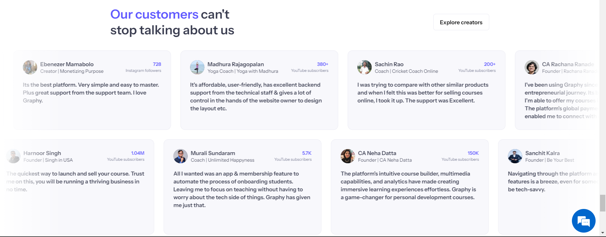

# Home Page Design Overview

The home page consists of 7 sections, each designed to provide a seamless and engaging user experience. Below is a detailed description of each section:

## 1. Landing Page

**Reference**: [Graphy](https://graphy.com/)

**Description**:

- As the user scrolls, 3-4 key words will dynamically change.
- Accompanying images will also update to reflect these words.
- This section will highlight our core offerings with relevant images.

## 2. About Us

**Reference**: [PW Live](https://pw.live)

**Description**:

- This section features three cards detailing our mission, vision, and values.
- Each card includes a subheading and descriptive text.
- A vector image will complement the content of each card.

## 3. Collaborations

**Description**:

- Displays images of partner companies.
- Since we currently don't have collaborations, this section will follow the existing website's UI.

## 4. Courses

**Description**:

- Showcases a list of the top 12-15 courses.
- The UI will remain consistent with the existing website's design.

## 5. Explore Categories

**Reference**: [PW Live](https://pw.live)

**Description**:

- A background video with a slightly lowered card at the forefront.
- The card will contain several small rectangular cards, each with an image and category name.
- Clicking on a category redirects to a browse course page with the selected category pre-filtered.
- Images relevant to the categories will be uploaded by the admin.

## 6. Stats

**Reference**: [PW Live](https://pw.live)

**Description**:

- Features 3-4 cards displaying key statistics such as total courses, total students, ratings, etc.
- Hovering over a card will trigger an animation where a vector pops out of the card.

## 7. Testimonials

**Reference**: [Graphy](https://graphy.com/)

**Description**:

- Contains two rows of review cards moving in opposite directions.
- Hovering over a card stops the animation, allowing users to read the testimonial.

